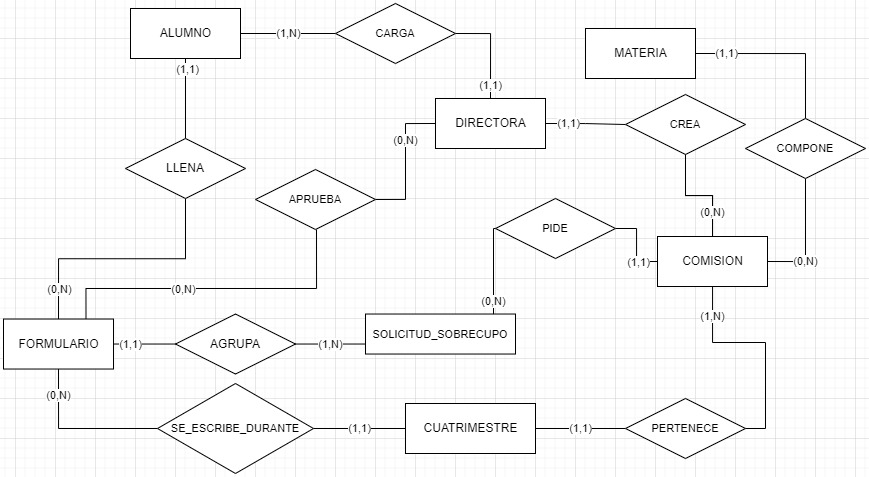

 [](https://www.codacy.com/gh/fagustin07/UNQUE-PostInscripciones-backend/dashboard?utm_source=github.com&amp;utm_medium=referral&amp;utm_content=fagustin07/UNQUE-PostInscripciones-backend&amp;utm_campaign=Badge_Grade) [](https://www.codacy.com/gh/fagustin07/UNQUE-PostInscripciones-backend/dashboard?utm_source=github.com&utm_medium=referral&utm_content=fagustin07/UNQUE-PostInscripciones-backend&utm_campaign=Badge_Coverage)

# UNQUE-PostInscripciones

Aplicación para facilitar la asignación de sobre cupos de las materias de una carrera en forma práctica, intuitiva y equitativa entre los alumnos que se quedaron sin cupo en el momento de la inscripción. 🎓

## Requerimientos
  - [Java 1.8](https://www.java.com/es/download/help/java8_es.html) ☕
  - [Docker](https://docs.docker.com/get-docker/) 🐳
  - [Docker Compose](https://docs.docker.com/compose/install/) 🐳
  - [Gradle](https://docs.gradle.org/current/userguide/userguide.html) 🐘

## Instalación

1. ### Clonar repositorio:
    <pre><code>git clone https://github.com/fagustin07/UNQUE-PostInscripciones-backend.git</code></pre>
2. ### Preparar la APP:
  - Cree un archivo [.env](https://github.com/fagustin07/UNQUE-PostInscripciones-backend/blob/dev/.env.example) 📋 dentro de la carpeta y configurelo utilizando como base el archivo [.env.example](https://github.com/fagustin07/UNQUE-PostInscripciones-backend/blob/dev/.env.example). Luego, asigne los valores correspondientes a cada variable.<br>
    - ```MYSQLDB_USER:``` Usuario de la base de datos. <br>
    - ```MYSQLDB_ROOT_PASSWORD:``` Constraseña de la base de datos.<br>
    - ```MYSQLDB_DATABASE:``` Nombre de la base de datos.
    - ```MYSQLDB_LOCAL_PORT:``` Puerto local para acceder a la base de datos.
    - ```MYSQLDB_DOCKER_PORT:``` Puerto de la base de datos en el contenedor.
    - ```SPRING_LOCAL_PORT:``` Puerto local de la aplicación.
    - ```SPRING_DOCKER_PORT:``` Puerto de la aplicación en el contenedor.
    - ```SPRING_SECURITY_USER:``` Usuario de spring security.
    - ```SPRING_SECURITY_PASSWORD:``` Contraseña de spring security.
3. ### Buildear la APP:
  - Crear archivo JAR: 
    ```
    ./gradlew build
    ```
  - Crear imagen de Docker: 
    ```
    docker-compose build --no-cache
    ```
4. ### Correr la APP:
    ```
    docker-compose up -d
    ```
    La aplicación se encontrara ejecutandose en el puerto indicado en ```SPRING_LOCAL_PORT:```
    
## Diagrama de relaciones
 

